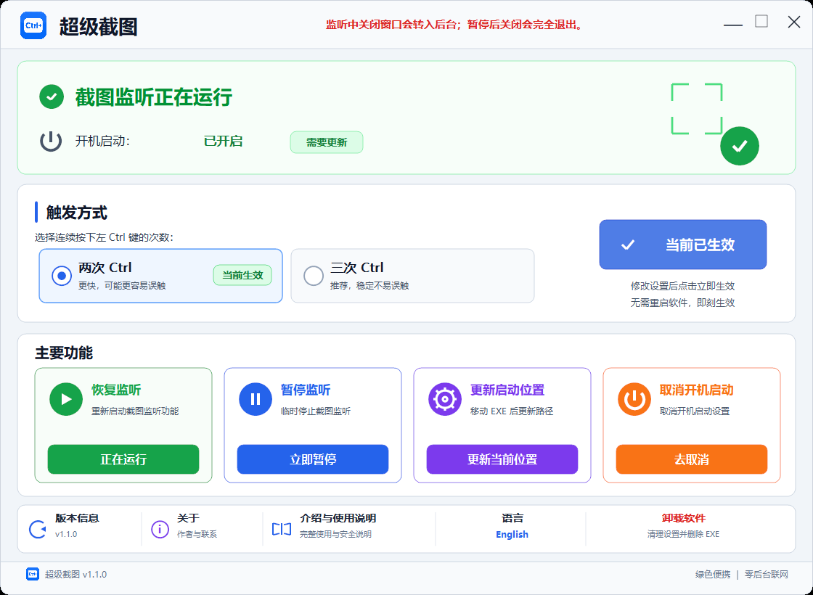

# 超级截图脚本版 / Super Screenshot Script Edition

> 连续轻按三次左 Ctrl，快速调用 Windows 系统截图。 
> Press Left Ctrl three times to open the Windows Snipping Tool.

这是“超级截图”的免费开源脚本版，使用 VBScript 启动一个隐藏的 PowerShell 监听器。它只识别三次独立的左 Ctrl 点击，然后模拟 Windows 原生快捷键 `Win + Shift + S`。

This repository contains the free and open-source script edition of Super Screenshot. A small VBScript launcher starts a hidden PowerShell listener. Three separate Left Ctrl taps trigger the native Windows shortcut `Win + Shift + S`.

Current version: **1.1.0**

## 功能 / Features

- 三次左 Ctrl 触发，单次间隔不超过 500ms
- 只识别左 Ctrl；右 Ctrl 不触发
- 长按只计一次，`Ctrl+C`、`Ctrl+V` 等组合键不累计
- 不拦截原有按键或其他软件快捷键
- 支持启动、停止、启用和关闭开机启动
- 单实例后台监听
- 不联网、不上传截图、不记录输入文字
- Windows 10 / 11 64 位

- Triple-tap Left Ctrl with a maximum 500ms gap
- Left Ctrl only; Right Ctrl does not trigger it
- Key holds count once; Ctrl shortcuts do not accumulate taps
- Does not block normal keys or existing shortcuts
- Start, stop, enable startup, and disable startup scripts included
- Single background listener instance
- No networking, screenshot upload, telemetry, or typed-text logging
- Windows 10 / 11 64-bit

## 快速开始 / Quick Start

下载或克隆仓库后，进入 `source` 目录：

1. 双击 `Start-TripleCtrl-Screenshot.vbs`。
2. 连续轻按三次左 Ctrl。
3. Windows 区域截图界面会打开。
4. 需要关闭监听时，运行 `Stop-TripleCtrl-Screenshot.bat`。

After downloading or cloning the repository, open `source`:

1. Double-click `Start-TripleCtrl-Screenshot.vbs`.
2. Tap Left Ctrl three times.
3. The Windows Snipping Tool overlay opens.
4. Run `Stop-TripleCtrl-Screenshot.bat` to stop the listener.

Detailed instructions are in [docs/USAGE.md](docs/USAGE.md).

## 隐私与透明度 / Privacy & Transparency

该工具使用 Windows 低级键盘 Hook 判断左 Ctrl 的按下和松开，但不会保存完整键盘记录、读取密码、读取截图、访问剪贴板或连接服务器。截图本身完全由 Windows 处理。

The tool uses a Windows low-level keyboard hook to evaluate Left Ctrl press/release events. It does not store full keyboard logs, read passwords or screenshots, access screenshot clipboard data, or connect to a server. Windows performs the screenshot operation.

See [docs/PRIVACY_AND_SECURITY.md](docs/PRIVACY_AND_SECURITY.md) for the exact behavior and limitations.

Validation notes and the tested environment are recorded in [docs/VALIDATION.md](docs/VALIDATION.md).

## 开源版与其他版本 / Editions

本仓库只包含固定“三按左 Ctrl”的脚本版。原生 GUI、双按/三按切换和托盘功能不属于本仓库，不应根据旧 HTML 展示稿推断本版本功能。

This repository contains only the fixed triple-tap script edition. Native GUI, configurable double/triple tap, and tray features are not part of this repository. Historical HTML mockups are not executable features and are intentionally excluded.

### Windows 完整版 / Full Windows Edition

完整的原生 Windows 版包含两个可直接运行的绿色 EXE，**合计 US$3.99**：

| 版本 | 适合谁 | 主要区别 |
|---|---|---|
| 托盘显示版 | 推荐大多数用户 | 显示托盘图标，可从托盘打开、暂停/恢复或退出 |
| 隐藏托盘版 | 希望后台更整洁的用户 | 不显示托盘图标；再次运行同一 EXE 可唤回窗口 |

一次购买同时包含两个版本，并允许购买者在**本人拥有或日常使用的多台 Windows 电脑**上使用。付款确认后，请提供 GitHub 用户名，我会邀请你进入私有仓库获取两个 EXE、使用说明、更新和完整资料。不得转售、公开分享或转发给其他人。

优先通过微信联系：`ZZSygwh2025`。价格为 **US$3.99**，使用微信付款时按付款当时的汇率折算；付款前请先添加微信确认。也可通过 Email 联系。

The native Windows edition includes both the tray and hidden-tray portable EXE editions for **US$3.99 total**. One purchase permits the buyer to use the software on multiple Windows computers they personally own or regularly use. After payment is confirmed, send your GitHub username to receive an invitation to the private repository. Redistribution, resale, public sharing, and forwarding to other people are not permitted.

WeChat is preferred: `ZZSygwh2025`. Please contact me before paying. Email is also available. See the [complete purchase and edition details](docs/COMMERCIAL_EDITION.md).

## 联系 / Contact

- GitHub: [liuyifeiyifei999-bot](https://github.com/liuyifeiyifei999-bot)
- Email: [liuyifeiyifei999@gmail.com](mailto:liuyifeiyifei999@gmail.com)
- WeChat: `ZZSygwh2025`

## License

[MIT License](LICENSE) © 2026 liuyifeiyifei999-bot
