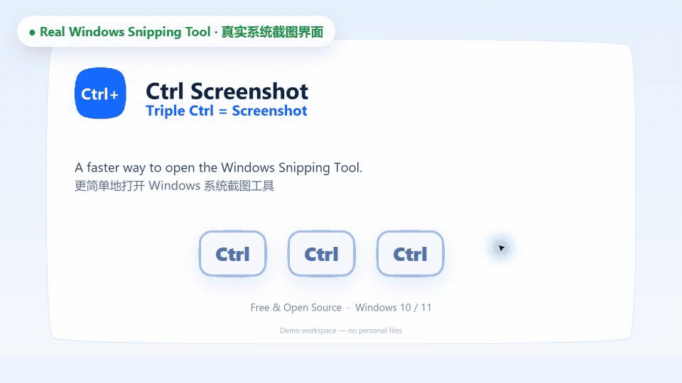
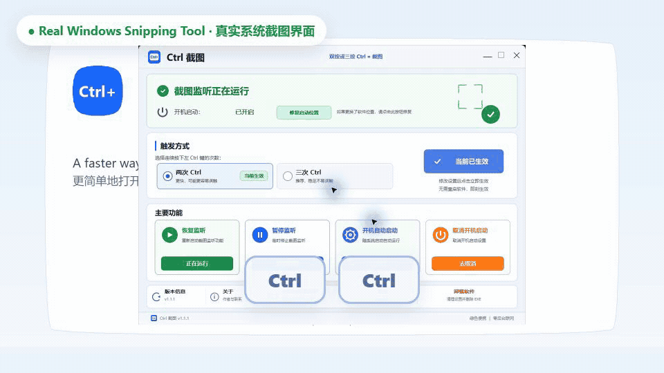

# Ctrl Screenshot

## Triple Ctrl = Screenshot

**三按 Ctrl = 截图**

Turn `Win + Shift + S` into three simple Left Ctrl taps.

Windows 自带截图已经很好用。Ctrl Screenshot 不重新制作截图工具，只把截图这个高频动作变得更容易触发。

**Free & Open Source · 免费开源 · 无需安装 · 不联网**

[**⬇ Download Ctrl Screenshot Free v1.1.1**](https://github.com/liuyifeiyifei999-bot/ctrl-screenshot-windows/releases/download/v1.1.1/Ctrl-Screenshot-Free-v1.1.1.zip)

[观看 Free 完整演示 MP4 / Watch the full Free demo](https://github.com/liuyifeiyifei999-bot/ctrl-screenshot-windows/releases/download/v1.1.1/Ctrl-Screenshot-Free-Demo-v1.1.1.mp4)

Current version: **1.1.1**

## 免费版快速开始 / Free Quick Start

1. 下载上方 ZIP。
2. 解压 ZIP。
3. 双击 `Start-TripleCtrl-Screenshot.vbs`。
4. 连续轻按三次左 Ctrl。

停止监听时，双击 `Stop-TripleCtrl-Screenshot.bat`。开机启动辅助文件也已经放在同一目录中。

1. Download the ZIP above.
2. Extract it.
3. Double-click `Start-TripleCtrl-Screenshot.vbs`.
4. Triple-tap Left Ctrl.

No installer, account, or background networking is required. Full instructions: [Usage](docs/USAGE.md).

## 为什么 Ctrl Screenshot？ / Why Ctrl Screenshot?

传统方式：`Win + Shift + S`

Ctrl Screenshot：`Triple Ctrl = Screenshot`

Left Ctrl 是左手很容易找到的按键。连续轻按后，截图可以变成自然的肌肉记忆。区域选择、截图、剪贴板和通知仍然全部由 Windows 处理。

Ctrl Screenshot does not replace the Windows Snipping Tool. It only makes it faster to open.

## Free vs Pro

| 功能 / Feature | Ctrl Screenshot Free | Ctrl Screenshot Pro |
|---|---:|---:|
| 三按左 Ctrl 截图 / Triple Ctrl | ✅ | ✅ |
| 双按左 Ctrl 截图 / Double Ctrl | — | ✅ |
| 原生图形界面 / Native GUI | — | ✅ |
| 中文 / English | — | ✅ |
| 托盘控制 / Tray controls | — | ✅ |
| 隐藏托盘版 / Hidden-tray edition | — | ✅ |
| 开机启动 / Start with Windows | ✅ | ✅ |
| 绿色便携 / Portable | ✅ | ✅ |
| 不上传截图 / No screenshot upload | ✅ | ✅ |
| 价格 / Price | Free | **一次性购买 · US$3.99** |

## Want Double Ctrl? → Ctrl Screenshot Pro

### Double Ctrl or Triple Ctrl = Screenshot

Pro 是原生 Windows GUI，可切换双按或三按，并同时包含托盘显示版和隐藏托盘版。

**One-time purchase · US$3.99**

**一次性购买 · US$3.99**

Includes both Tray and Hidden Tray editions. 可供购买者本人在多台 Windows 电脑使用。

- [观看 Pro 完整操作演示 MP4 / Watch the full Pro demo](https://github.com/liuyifeiyifei999-bot/ctrl-screenshot-windows/releases/download/v1.1.1/Ctrl-Screenshot-Pro-Demo.mp4)
- [查看 Pro 介绍、购买方式和授权说明 / Pro details](docs/COMMERCIAL_EDITION.md)

Pro EXE、C 源码和构建资料不在此公开仓库或公开 Release 中提供。

## 隐私 / Privacy

- No account / 无需账号
- No screenshot upload / 不上传截图
- No telemetry / 无遥测
- No ads / 无广告
- Screenshot handled by Windows / 截图由 Windows 处理

详细行为和限制见 [隐私与安全](docs/PRIVACY_AND_SECURITY.md)。

## 工作原理 / How It Works

免费版使用 VBScript 启动隐藏的 PowerShell 监听器，只判断左 Ctrl 的独立按下与松开。三次有效轻按后，它通过 `SendInput` 调用 `Win + Shift + S`。右 Ctrl、长按以及 `Ctrl+C`、`Ctrl+V` 等组合键不会累计，原有按键仍会传递给当前软件。

The Free edition launches a hidden PowerShell listener through VBScript. It counts independent Left Ctrl taps and uses `SendInput` to invoke `Win + Shift + S` after three valid taps.

## 文档 / Documentation

- [使用教程 / Usage](docs/USAGE.md)
- [常见问题 / Troubleshooting](docs/TROUBLESHOOTING.md)
- [隐私与安全 / Privacy & Security](docs/PRIVACY_AND_SECURITY.md)
- [校验记录 / Validation](docs/VALIDATION.md)
- [更新日志 / Changelog](CHANGELOG.md)
- [Ctrl Screenshot Pro](docs/COMMERCIAL_EDITION.md)

## 联系 / Contact

- GitHub: [liuyifeiyifei999-bot](https://github.com/liuyifeiyifei999-bot)
- Email: [liuyifeiyifei999@gmail.com](mailto:liuyifeiyifei999@gmail.com)
- WeChat: `ZZSygwh2025`

## License

公开仓库中的 Ctrl Screenshot Free 按 [MIT License](LICENSE) 授权。Ctrl Screenshot Pro 的 C 源码、商业 EXE 和私有资料不属于 MIT 授权范围。

Ctrl Screenshot Free is licensed under the [MIT License](LICENSE). Proprietary Pro source, EXE files, and private materials are not covered by the MIT License.
