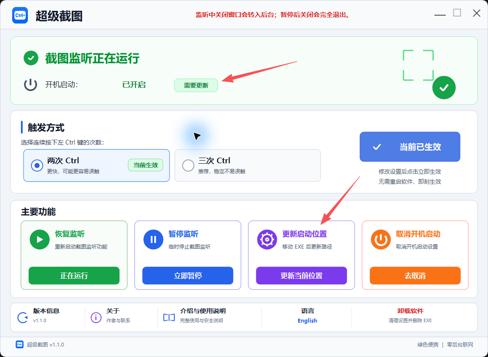

# Windows 完整版 / Full Windows Edition

## 中文介绍

超级截图 Windows 完整版是一款轻量级、绿色便携的原生 Windows 程序。连续轻按两次或三次左 Ctrl，即可调用 Windows 系统截图工具。软件只负责识别触发动作；选区、截图、剪贴板和通知仍由 Windows 处理。

### 一次购买包含两个版本

| 版本 | 文件 | 使用方式 |
|---|---|---|
| 托盘显示版 | `超级截图.exe` | 推荐普通用户；托盘菜单可打开主界面、暂停/恢复监听或退出 |
| 隐藏托盘版 | `超级截图_隐藏托盘版.exe` | 不显示托盘图标；监听时关闭窗口仍在后台运行，再次运行可唤回 |

两个版本都支持：

- 双按 / 三按左 Ctrl 自由切换
- 简体中文 / English 界面切换并保存设置
- 暂停、恢复和单实例运行
- 开启、关闭以及在 EXE 移动后修复开机启动路径
- 调用 Windows 原生截图，不读取或上传截图内容
- 无后台联网、无遥测、无广告
- Windows 10 / 11 64 位

两个版本共用设置，属于二选一版本，请勿同时运行。

### 开机启动路径修复

**只要您移动或重命名了 EXE，从新位置运行软件并点击紫色的“更新启动位置”按钮，就会立即修复开机启动路径。** 现在点击可以，以后手动打开软件再点击也可以，不需要等到下一次开机。上方的“需要更新”表示开机启动仍然开启，但 Windows 记录的还是原来的 EXE 路径。修复完成后，后续开机都会从新位置自动启动。橙色的“取消开机启动”按钮才是关闭自动启动。

After moving or renaming the EXE, run it from the new location and click **Update startup location** to repair the saved path immediately. You can do this now or whenever you next open the app manually; there is no need to wait for another Windows startup. The top status indicates that startup is still enabled but Windows has the old EXE path. After repair, future Windows startups use the new location. **Disable startup** is the separate action that turns automatic startup off.

### 价格与获取方式

- 两个 EXE 合计：**US$3.99**，不是每个版本分别收费。
- 一次购买允许购买者在本人拥有或日常使用的多台 Windows 电脑上使用。
- 优先通过微信联系：`ZZSygwh2025`。
- 使用微信付款时按付款当时的汇率折算人民币；付款前请先联系确认。
- 付款确认后，请提供你的 GitHub 用户名；我会邀请你进入私有仓库。
- 私有仓库中提供两个 EXE、使用说明、更新、校验文件和完整资料。
- 也可以通过 Email 联系：`liuyifeiyifei999@gmail.com`。

### 授权边界

购买的是个人多设备使用权以及对应私有仓库访问权。不得把私有仓库内容或 EXE 转售、公开上传、共享账号、复制给其他人，或用于制作和销售衍生版本。团队、公司部署或其他授权需求请先联系。

公开脚本版仍按本仓库的 [MIT License](../LICENSE) 免费开源；MIT License 不适用于私有仓库中的 C 源码和商业 EXE。

## English

Super Screenshot Full Windows Edition is a lightweight, portable native Windows app. Double- or triple-tap Left Ctrl to open the native Windows Snipping Tool. The app only recognizes the trigger; Windows continues to handle region selection, capture, clipboard, and notifications.

One **US$3.99** purchase includes both portable EXE editions:

- **Tray edition:** recommended for most users; open, pause/resume, or exit from the tray menu.
- **Hidden-tray edition:** no tray icon; closing the window while listening keeps it running in the background, and launching the same EXE reopens the window.

The license permits the buyer to use the software on multiple Windows computers they personally own or regularly use. It does not permit redistribution, resale, public upload, account sharing, forwarding to others, or creating commercial derivative versions.

WeChat is preferred: `ZZSygwh2025`. Contact me before paying. After payment is confirmed, send your GitHub username and you will be invited to the private repository. Email: `liuyifeiyifei999@gmail.com`.

The free script edition remains available under the [MIT License](../LICENSE). That MIT License does not cover the proprietary C source or commercial EXE files in the private repository.
