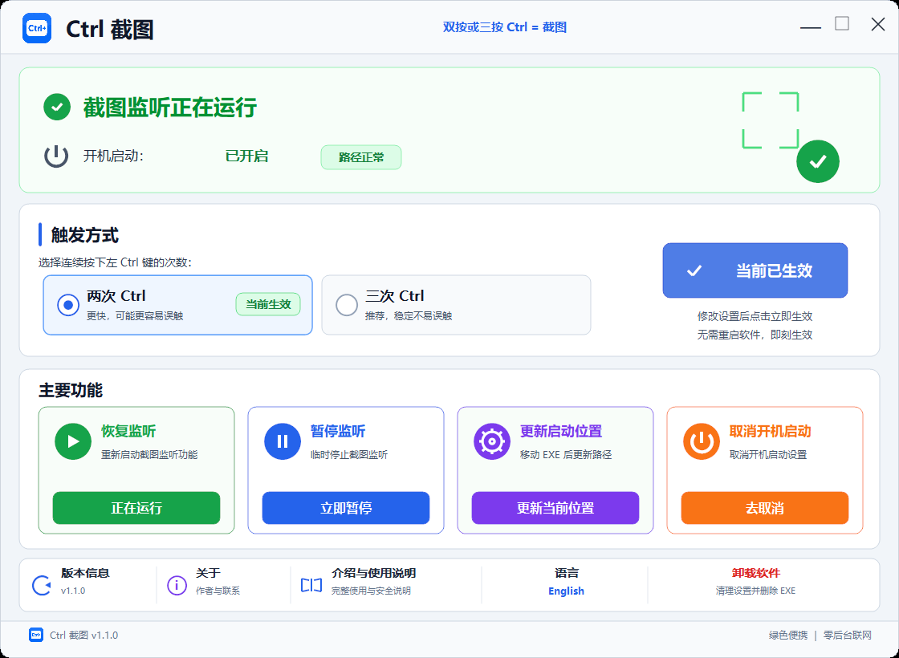
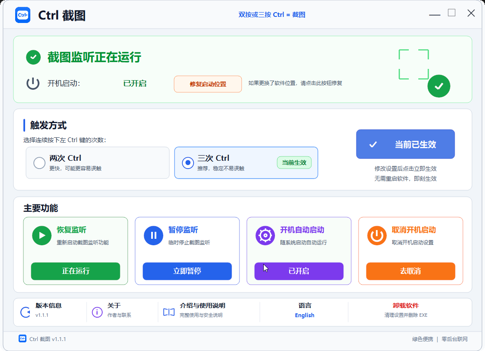

# Ctrl Screenshot Pro

## Double Ctrl or Triple Ctrl = Screenshot

**双按或三按 Ctrl = 截图**

Current Pro version: **1.1.1**

[观看完整操作演示 MP4 / Watch the full operation demo](https://github.com/liuyifeiyifei999-bot/ctrl-screenshot-windows/releases/download/v1.1.1/Ctrl-Screenshot-Pro-Demo.mp4)

把 `Win + Shift + S` 变成连续轻按两次或三次左 Ctrl。Ctrl Screenshot Pro 只优化触发动作；选区、截图、剪贴板和通知仍由 Windows 系统截图工具处理。

## 一次购买包含两个版本 / Two Editions Included

### Tray Edition / 托盘显示版

适合绝大多数用户。系统托盘中可以打开主界面、暂停、恢复或退出。

Recommended for most users. Open, pause, resume, or exit from the tray menu.

### Hidden Tray Edition / 隐藏托盘版

适合希望后台完全安静的用户。无托盘图标；关闭窗口后继续后台运行，再次运行同一 EXE 可唤回界面。

No tray icon. Closing the window keeps it running in the background; launch the same EXE again to reopen it.

| 版本 | 文件 |
|---|---|
| Tray Edition | `Ctrl Screenshot.exe` |
| Hidden Tray Edition | `Ctrl Screenshot Hidden.exe` |

## One-time purchase · US$3.99

Includes both Tray and Hidden Tray editions.

**一次性购买 · US$3.99**（非订阅），同时包含两个 EXE，不是每个版本分别收费。

两个版本都支持：

- Double Ctrl or Triple Ctrl = Screenshot
- 简体中文 / English 界面切换并保存设置
- 暂停、恢复和单实例运行
- 开启、关闭以及在 EXE 移动后修复开机启动路径
- 绿色便携，无需安装
- 无后台联网、无遥测、无广告
- 不读取或上传截图内容
- Windows 10 / 11 64 位

两个版本共用设置和单实例机制，请二选一使用，不要同时运行。

## 更换 EXE 位置 / Moving the EXE

> 下方“开机自动启动”只负责开启自动启动。如果您更换了 EXE 的位置，请点击上方“修复启动位置”按钮直接修复。

点击后会先提示“如果您更换了这个软件的位置，请点击‘是’修复开机启动路径”。确认后，软件会立即把路径修复为当前 EXE 的位置并显示成功信息。现在点击或以后手动打开软件再点击都可以；修复后，后续开机都会从新位置自动启动。“取消开机启动”才是关闭自动启动。

**Start automatically** below enables automatic startup. After moving the EXE, run it from the new location and click **Repair startup path** at the top. The saved path is repaired immediately. **Disable startup** is the separate action that turns automatic startup off.

## 价格与获取方式 / Purchase

- 价格：**一次性购买 · US$3.99**（非订阅），同时包含两个版本。
- 允许购买者在本人拥有或日常使用的多台 Windows 电脑上使用。
- 优先通过微信联系：`ZZSygwh2025`。
- 使用微信付款时按付款当时的汇率折算人民币；付款前请先联系确认。
- 付款确认后提供 GitHub 用户名，受邀进入私有仓库获取两个 EXE、说明、更新和校验文件。
- Email：`liuyifeiyifei999@gmail.com`。

WeChat is preferred. Contact me before paying, then send your GitHub username after payment is confirmed to receive an invitation to the private repository.

## 授权边界 / License Terms

购买的是个人多设备使用权和对应私有仓库访问权。不得转售、公开上传、转发给其他人、共享 GitHub 账号，或利用私有材料制作和销售衍生版本。团队、公司部署或其他授权需求请先联系。

The license permits personal use on multiple Windows computers the buyer owns or regularly uses. It does not permit redistribution, resale, public upload, account sharing, forwarding to others, or commercial derivative versions.

公开的 [Ctrl Screenshot Free](../README.md) 按 [MIT License](../LICENSE) 授权；该 MIT License 不适用于 Pro 的 C 源码、商业 EXE 和私有资料。
